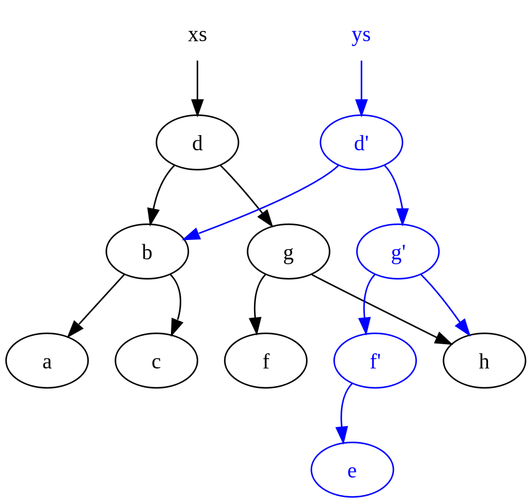

[comment]: # (THEME = night)

#   GIT и системы контроля версий

[comment]: # (!!!)
 <!-- .element: style="float:right; width: 100%;" -->

 1. очень распределённый процесс разработки, 
 2. очень высокие ставки (supply chain attack),
 3. очень большой массив кода,
 4. нет изоляции (Таненбаум предупреждал).

[comment]: # (!!!)

### Prior art

 <!-- .element: style="float:right; width: 50%;" -->
 1. tarballs
 2. CVS
 3. BitKeeper

[comment]: # (!!!)

### Внутреннее устройство
 <!-- .element: style="width: 80%;" -->

 1. blobs
 2. trees
 3. commits

[comment]: # (!!!)

### Persistent data structures

 <!-- .element: style="width: 50%; float: right;" -->

 1. partially
 2. fully
 3. confluently

[comment]: # (!!!)
### Меркелевы деревья

 <!-- .element: style="float:right; width: 50%;" -->
 1. хэш-функции
 2. деревья М.
 3. Merkle DAG

[comment]: # (!!!)

### Deltas and snapshots

 <!-- .element: style="float:right; width: 50%;" -->

 1. snapshots
 2. patches/diffs/deltas
 3. weaves

[comment]: # (!!!)

### Myers

 <!-- .element: style="width: 70%;" -->

[comment]: # (!!!)

### Workflow

 <!-- .element: style="width: 80%;" -->

[comment]: # (!!!)

### Complexity 

 <!-- .element: style="width: 80%;" -->

[comment]: # (!!!)

### Практика 

````bash [1|2-3|4-5|6|7|8]
gpg --full-generate-key
git config --global user.email user@domain.com
git config --global user.name "Vasily Petrov"
git init
git clone https://github.com/decentralized-hse/Cirriculum.git
git add file
git commit -S -m 'short message'
cat .git/objects/xy/z | openssl zlib -d 
````

[comment]: # (!!!)

