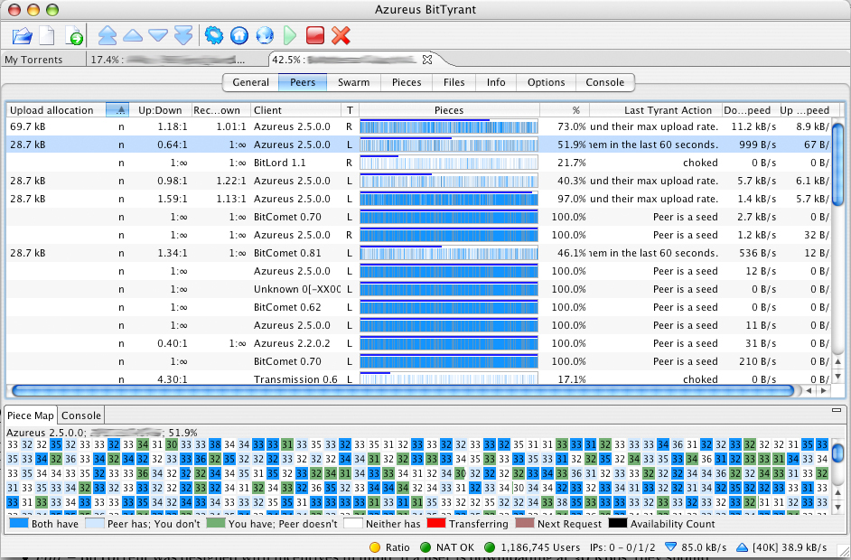

#   BitTorrent: P2P + Merkle trees

----
### Обстановка в 2000

 1. P2P в 2000
 2. MPAA и рынок
 3. MojoNation, Bram Cohen
 4. успех

----
### Устройство BitTorrent

 1. рой 
 2. кусочки
 3. метаданные
 4. алгоритмы

----
### Merkle tree

 1. BitTorrent Merkle tree
 2. Binary Merkle tree

----

----
### Rarest first

 1. swarm bw
 2. 99%
 3. rarest first

----
### Tit for tat

 1. хитрецы
 2. tit for tat
 3. BitTyrant etc
 4. LEDBAT

----
### Трекинг

 1. трекеры (сайты)
 2. PEX
 3. DHT Kademlia

----
### Сложности и ограничения

 1. редкий контент
 2. торрент файлы
 3. циклы инициализации
 4. экономика

----
### Развитие 

 1. RFC 7574
 2. IPFS
 3. BitTorrent v2

----
### Результаты

 1. Hulu
 2. Netflix
 3. iTunes

