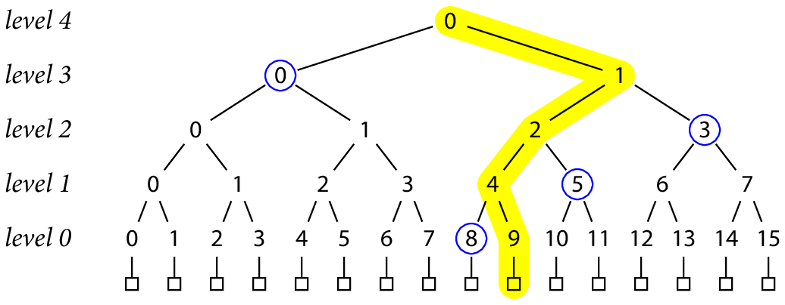

[comment]: # (THEME = night)

#   BitTorrent: P2P + Merkle trees

[comment]: # (!!!)

### Обстановка в 2000

 1. P2P в 2000
 2. MPAA и рынок
 3. MojoNation, Bram Cohen
 4. успех

[comment]: # (!!!)
### Устройство BitTorrent
 1. рой 
 <!-- .element: style="float:right; width: 70%; margin: 10px; " -->
 2. кусочки
 3. метаданные
 4. алгоритмы

[comment]: # (!!!)
### Merkle tree
 <!-- .element: style="float:right; width: 100%;" -->

 1. BitTorrent Merkle tree
 2. Binary Merkle tree

[comment]: # (!!!)
### Rarest first

 1. swarm bw
 <!-- .element: style="float:right; width: 70%; margin: 10px; " -->
 2. 99%
 3. rarest first

[comment]: # (!!!)
### Tit for tat

 1. хитрецы
 <!-- .element: style="float:right; width: 80%;" -->
 2. tit for tat
 3. BitTyrant etc
 4. LEDBAT

[comment]: # (!!!)
### Трекинг

 <!-- .element: style="float:right; width: 50%;" -->
 1. трекеры (сайты)
 2. PEX
 3. DHT Kademlia

[comment]: # (!!!)
### Сложности и ограничения

 1. редкий контент
 2. торрент файлы
 3. циклы инициализации
 4. экономика

[comment]: # (!!!)
### Развитие 

 1. RFC 7574
 2. IPFS
 3. BitTorrent v2

[comment]: # (!!!)
### Результаты

 1. Hulu
 2. Netflix
 3. iTunes

