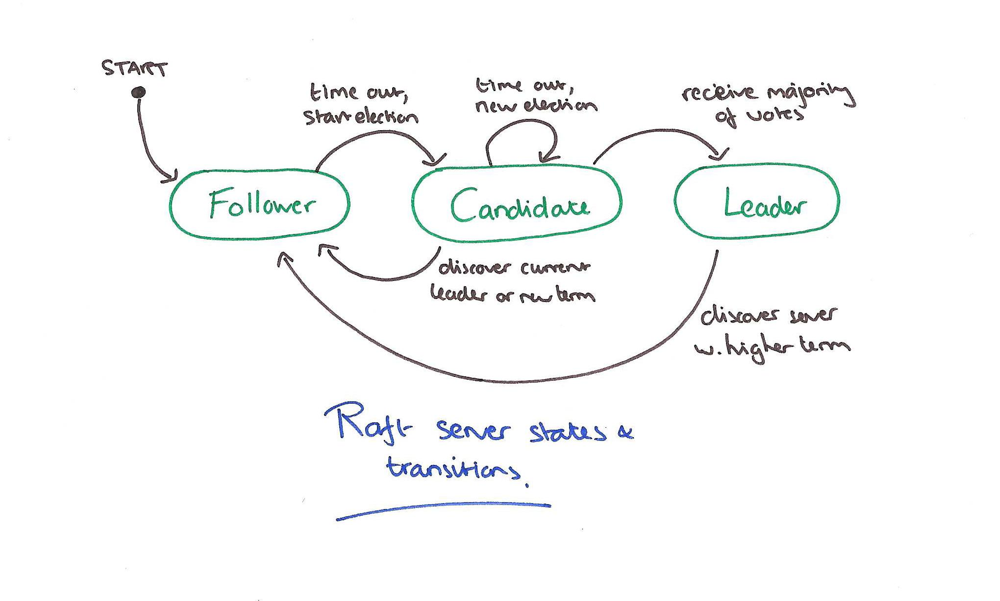
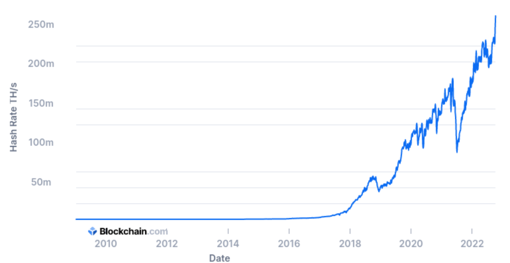
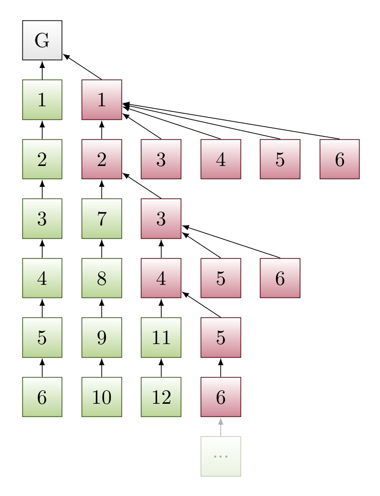

#   Консенсус 

    Impossibility of distributed consensus with one faulty process
    Michael J. Fischer, Nancy A. Lynch, Michael S. Paterson 1985
    
---
### 1984 State Machine Replication 

 1. Конечный автомат + лог операций
 2. Мастер-реплика
 3. Основа "классических" БД (MySQL, Oracle, Postgres, MongoDB)

---
### Paxos - обобщение для группы 

 1. $n = 2F + 1$
 2. Client, Acceptor, Proposer, Learner, Leader
 3. Кворум

---
### Raft - чуть проще

 1. Leader, candidate, follower
 2. Ортогонализация

---
### Byzantine generals

 1. Святослав Игоревич
 2. Проблема генералов
 3. n = 3F + 1
 4. С криптографией проще

---
### Proof of Work

---
### Proof of stake

 1. Greedy Heaviest-Observed Sub-Tree (GHOST), Casper, Gasper 
 2. легион

