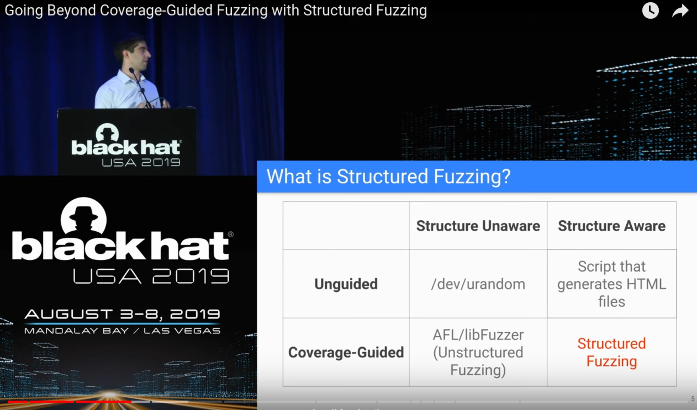

#   Фаззинг

 Атака мартышек

----
##  Методы тестирования

 1. unit tests, property tests
 2. static analysis
 3. ...?

----
##  Эволюция фаззинга

 1. black box
 2. structure aware
 3. coverage guided (instrumentation)
 4. structured fuzzing

----

----
##  Что фаззить

 1. форматы и протоколы
 2. базы данных
 3. stateful/stateless
 4. компиляторы
 5. сервера

----
##  Как фаззить

 1. на падение
 2. на свойство
 3. на совпадение
 4. structured
 5. слона едят по частям

----
##  Интеграция в рабочий процесс

 1. Юнит тесты
 2. Property tests
 3. Фазз тесты, корпус
 4. CI
 5. OSS-fuzz

----
##  Обзор проектов
 
 1. csmith
 2. klee 
 3. afl
 4. libfuzzer 
 5. kali 

