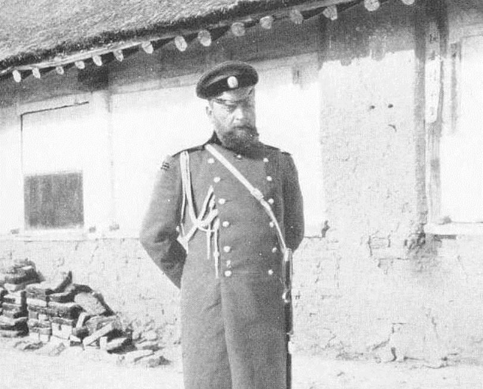

#   Криптография: шифры, подписи, хэши

<video autoplay="on" loop="on" src="media/mycrypto.mp4"/>

----
##  Древние

  - Аристотель - криптоаналитик
  - цезарь
  - тарабарщина

````
б в г д ж з к л м н
щ ш ч ц х ф т с р п
````

----
##  Grand Chiffre


  - Rossignol
  - слоговый шифр
  - 131/711 это "e" 

----
##  WWI Танненберг


----
##  Роторные и enigma


  - ввод/вывод
  - [роторы][e]
  - рефлектор
  - штекеры

[e]: https://www.quora.com/How-exactly-did-the-Enigma-machine-work-How-did-the-plugboard-and-the-rotors-change-the-letters/answer/Werner-Hermann-3
----
##  Роторные и enigma (2)


  - уязвимость - штекеры
  - уязвимость - рефлектор
  - уязвимость - роторы

----
##  Crypto AG

  - Хагелин и Фридман, 1955
  - 1970 CIA&BND
  - “too bright to remain unwitting” 
  - Палево

[c]: https://www.washingtonpost.com/graphics/2020/world/national-security/cia-crypto-encryption-machines-espionage/

----
##  Примитив: хэш-функция

 1. быстро считается
 2. невозможно подобрать данные под хэш
 3. $h(a)=h(b) \implies a=b$ 
 4. эффект лавины

----
##  Блочные симметричные


  - SP-сеть
  - Фейстель
  - режим работы блочного шифра
  - ГОСТ [Кузнечик, Магма][k]

[k]: https://habr.com/ru/post/530816/?ysclid=l9l190ann207151473

----
##  Поточные симметричные шифры

  - гамма
  - Шеннон
  - Бернштейн: Salsa, ChaCha 

----
##  Асимметричные

  - RSA
  - заплатки
  - Elliptic Curve

----
##  Обмен ключами

  - Классика
  - Diffie-Hellman
  - Привет от Сноудена
  - [LogJam][l]
  - PKI

[l]: https://weakdh.org/

----
##  Конструкции Меркла


  - Эффект лавины-лавины

----
##  Выводы

  - NOBUS
  - Подстава - норма жизни
  - Проверка практикой (ZKP)
  - Граничные условия
  - ЛПП

----
##  Практика: разбор libsodium
----
##  Практика: разбор OpenSSL
----


10. общая ситуация (NSA, Бернштейн, МО РФ)
- Симметричные шифры
- - Блочные
- - - Режимы шифрования (ECB, CBC и т.д.)
- - - Сеть Фейстеля (DES)
- - - SPN (AES)
- - Потоковые
- - - Генераторы псевдослучайных последовательностей (LFSR)
- - - Гаммирование (RC4)
- Асиметричные (Rabin, RSA)
- Обмен ключами (Diffie–Hellman)
- Конструкции Мёркла


