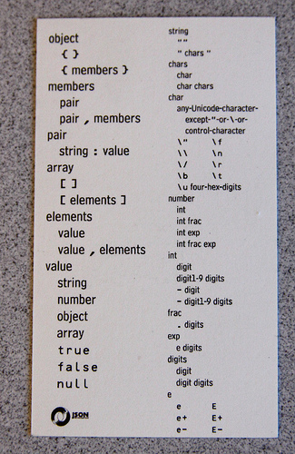
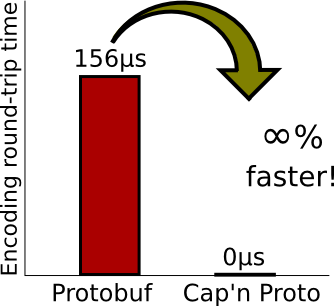

#   Форматы сериализации


----
##  SMTP, [HTTP][h], etc

````
HTTP/1.1 304 Not Modified
Server: nginx
Date: Mon, 31 Oct 2022 06:26:40 GMT
Connection: keep-alive
ETag: "10184-5eb742298960c"
````

Типичны регулярные грамматики,
хорошо парсятся [Ragel][r]'eм
([не всегда][l] удачно)

[l]: https://blog.cloudflare.com/quantifying-the-impact-of-cloudbleed/
[r]: http://www.colm.net/open-source/ragel/
[h]: https://www.rfc-editor.org/rfc/rfc7231

----
##  XML

с XML всё понятно

----
##  JSON


  - {"key":["array","of","values"]}
  - [json.org][j]
  - IETF RFCs, ECMA standard

[j]: http://json.org
----
##  JSON is a [minefield][m]


[m]: http://seriot.ch/projects/parsing_json.html

----
##  Unicode

  - UCS-2
  - UTF-16
  - UTF-8
  - UTF-32
  
----
##  TCP/IP etc 


[C struct 1:1][1]

[1]: https://linux-kernel-labs.github.io/refs/pull/183/merge/labs/networking.html
----
##  TLV binary

 1. type
 2. length
 3. value

----
##  [Protobuf][p]

````
message Person {
  optional string name = 1;
  optional int32 id = 2;
  optional string email = 3;
}
````

TLV-like [coding][t]

[p]: https://developers.google.com/protocol-buffers
[t]: https://developers.google.com/protocol-buffers/docs/encoding

----
##  [FlatBuffers][b]/[Cap'n Proto][c]



  - there is no spoon
  - Realm

[b]: https://google.github.io/flatbuffers/
[c]: https://capnproto.org/

----
##  Databases 


  - B-Trees
  - Log Structured \
    Merge Trees
  - Columnar
  - [Datoms][d] (see [Fleet][f])

  [d]: https://docs.datomic.com/cloud/whatis/data-model.html
  [f]: https://blog.jetbrains.com/fleet/


----
##  In vivo

  - BitCoin
  - git
  - BitTorrent
